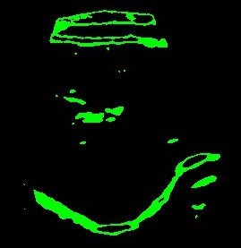

<!--
@Author: Tian Qiao <qiaotian>
@Date:   2016-05-26T21:07:10+08:00
@Email:  qiaotian@me.com
@Last modified by:   root
@Last modified time: 2016-06-12T15:32:08+08:00
@License: DO WHAT THE FUCK YOU WANT TO PUBLIC LICENSE
-->

# Mornitoring Respiration Movements by Tracking Ultrasound Image Sequences

## Dataset

Nine 2D ultrasound sequences of the liver of healthy volunteers were acquired during free breathing over a period of 5-10 min. Please refer to the following publications:

[1] L. Petrusca, P. Cattin, V. De Luca, F. Preiswerk, Z. Celicanin, V. Auboiroux, M. Viallon, P. Arnold, F. Santini, S. Terraz, K. Scheffler, C. D. Becker, R. Salomir, "Hybrid Ultrasound/Magnetic Resonance Simultaneous Acquisition and Image Fusion for Motion Monitoring in the Upper Abdomen", Investigative Radiology, Vol. 48, No. 5, pp. 333-340, 2013.

[2] V. De Luca, M. Tschannen, G. Székely, C. Tanner, "A Learning-based Approach for Fast and Robust Vessel Tracking in Long Ultrasound Sequences", Medical Image Computing and Computer-Assisted Intervention, Springer. volume of LNCS 8149, pp. 518-525, 2013.

## Prerequisite:
CUDA, tensorflow, Numpy

## Methods

